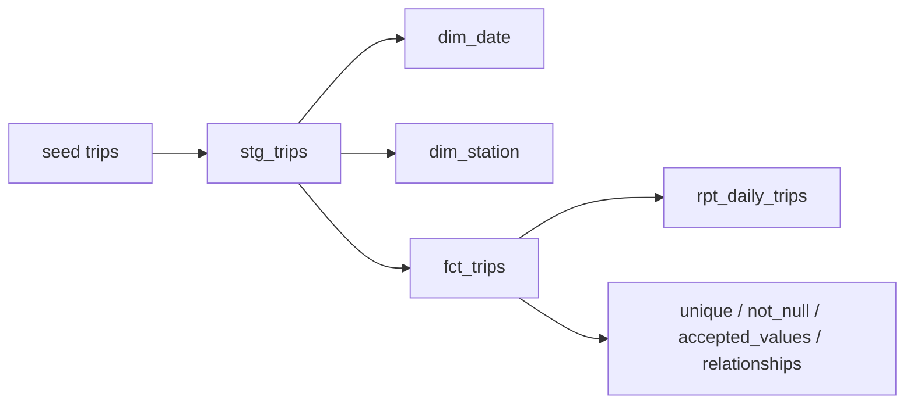

# dbt transit warehouse

Star schema on cleaned Citi Bike trips: staging, date and station dimensions, a trip fact, tests, and a catalog. DuckDB so the whole warehouse is one file.

## Problem

Gold Parquet is still a file dump. Analysts need conformed dimensions, documented grain, and tests that fail the build when a key breaks.

## Architecture



Grain of `fct_trips` is one row per `ride_id`.

## Stack

dbt Core, DuckDB, SQL, YAML tests. On Python 3.14 (this machine) `dbt` packages are not always installable, so `python -m warehouse run` executes the same models and tests through DuckDB.

## What a recruiter should notice

Dimensional modeling, not a SELECT *. Tests cover uniqueness, accepted values, and foreign keys from facts to dimensions.

## Run

Laptop runner (works on Python 3.11–3.14):

```bash
python3 -m venv .venv && source .venv/bin/activate
pip install duckdb
python -m warehouse run
```

dbt CLI (Python 3.11 or 3.12):

```bash
pip install -r requirements.txt
DBT_PROFILES_DIR=. dbt seed && DBT_PROFILES_DIR=. dbt run && DBT_PROFILES_DIR=. dbt test
```

The seed `seeds/trips.csv` is a silver extract from the lakehouse. The orchestrator can overwrite it with a fresh run.
