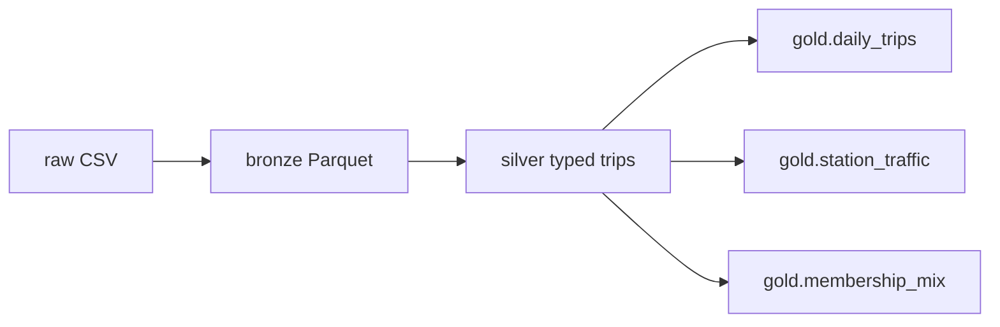

# Citi Bike lakehouse

Medallion pipeline that lands raw Citi Bike trips, types and cleans them, then publishes gold aggregates. Runs locally in a few seconds with a bundled sample.

## Problem

Trip extracts arrive as messy CSVs: mixed casing, duplicate `ride_id`s, missing stations, zero-length rides, and multi-day outliers. Analytics cannot sit on that file.

## Architecture



| Layer | Grain | What changes |
| --- | --- | --- |
| Bronze | one file as landed | No transforms. Schema is all strings. |
| Silver | one row per `ride_id` | Parse timestamps, compute `duration_sec`, drop invalid rides, dedupe. |
| Gold | daily / station / segment | Aggregates a warehouse or dashboard can consume. |

## Stack

Python, Polars, Parquet.

## What a recruiter should notice

Explicit layers, not a notebook. Silver is typed and tested against duration and membership rules. Gold is three small, named tables instead of one wide dump.

## Run

```bash
python3 -m venv .venv && source .venv/bin/activate
pip install -r requirements.txt
python -m pipeline run
```

Rebuild the sample (optional):

```bash
python scripts/generate_sample.py
```

Outputs land in `data/bronze`, `data/silver`, and `data/gold` (Parquet plus CSV for the next project).
