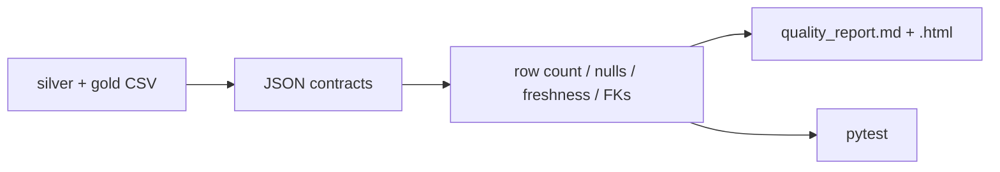

# Data quality framework

JSON contracts plus row-count, null-rate, freshness, accepted-values, and referential checks. Every run writes Markdown and HTML. pytest fails a PR when a contract breaks.

## Problem

A green dbt run is not the same as trustworthy data. Volume cliffs, stale files, and orphan station IDs still ship without a contract layer.

## Architecture



## Stack

Python, JSON contracts, pytest. No warehouse required for the fixture path.

## What a recruiter should notice

Quality as a product: versioned contracts, measurable checks, a human-readable report, and tests in CI.

## Run

```bash
python3 -m venv .venv && source .venv/bin/activate
pip install -r requirements.txt
python -m quality run
pytest
```

Point at a lakehouse output:

```bash
python -m quality run --data-root ../citibike-lakehouse/data
```
