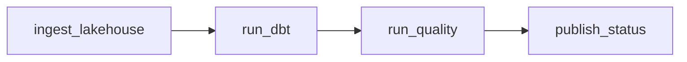

# Pipeline orchestration

Daily graph: lakehouse ingest → dbt warehouse → quality gate → status. An Airflow DAG for the shape recruiters expect, and a laptop runner that does not need Docker.

## Problem

Four scripts are not a platform. Order, failure, and a single command to replay the day are what production actually needs.

## Architecture



If any stage exits non-zero, downstream tasks do not run.

## Stack

Airflow DAG, Python orchestrator, optional Docker Compose.

## What a recruiter should notice

Explicit dependencies, a replayable daily job, and a path that runs on a laptop without a cluster.

## Run

```bash
python3 -m venv .venv && source .venv/bin/activate
pip install -r requirements.txt
python -m orchestrator run
```

The runner uses each sibling project's `.venv` when present. Run the lakehouse, warehouse, and quality projects once first so those environments exist.

Optional Airflow UI:

```bash
docker compose up
```

Then open http://localhost:8080 (admin / admin) and enable `citibike_daily`.
